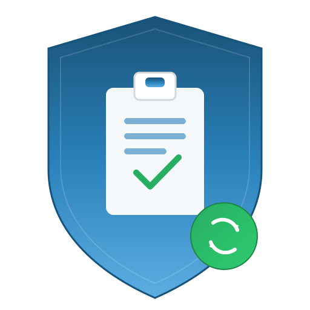

<p align="center">
  
</p>

<h1 align="center">RDPClipGuard</h1>

<p align="center">
  A lightweight Windows system tray application that monitors clipboard activity and automatically resets the <code>rdpclip.exe</code> process to prevent RDP clipboard failures.
</p>

## Problem

When using Remote Desktop (RDP), the clipboard often stops working after multiple copy-paste operations. The `rdpclip.exe` process becomes unresponsive and requires manual restart. This is a well-known Windows RDP issue.

## Solution

RDPClipGuard runs silently in the system tray and:

- **Monitors clipboard** every 2 seconds for new copy operations
- **Automatically resets `rdpclip.exe`** every 7 copy operations (preventive maintenance)
- **Detects clipboard failures** and immediately resets `rdpclip.exe` when the clipboard becomes inaccessible
- **Prevents duplicate instances** - only one instance can run at a time
- **Starts with Windows** (optional, configured during installation)

## System Tray Features

- **Double-click** the tray icon to see current status (copy count, last activity)
- **Right-click** context menu:
  - View copy count and status
  - **Reset rdpclip Now** - manually trigger an immediate reset
  - **Exit** - close the application

## Installation

### From Installer
1. Download `RDPClipGuard_Setup.exe` from the [Releases](../../releases) page
2. Run the installer
3. RDPClipGuard will start automatically and launch with Windows

### From Source
```bash
# Clone the repository
git clone https://github.com/yehuda-menachem/RDPClipGuard.git
cd RDPClipGuard

# Build
dotnet build -c Release

# Publish as single-file executable
dotnet publish -c Release
```

The executable will be at `bin/Release/net8.0-windows/win-x64/publish/RDPClipGuard.exe`

## Building the Installer

1. Install [Inno Setup](https://jrsoftware.org/isdl.php)
2. Publish the project: `dotnet publish -c Release`
3. Open `installer.iss` in Inno Setup Compiler
4. Click Build > Compile
5. The installer will be created in the `installer_output` folder

## Requirements

- Windows 10/11
- .NET 8 Runtime (included in self-contained build)
- Administrator privileges (for killing/restarting rdpclip.exe)

## Tech Stack

- **Language:** C# (.NET 8)
- **UI:** Windows Forms (System Tray only, no window)
- **Installer:** Inno Setup

## How It Works

1. The app starts and creates a system tray icon
2. A background timer polls the clipboard every 2 seconds
3. When a new copy is detected, the counter increments
4. Every 7 copies, `rdpclip.exe` is killed and restarted
5. If the clipboard becomes inaccessible, an immediate reset is triggered

## License

MIT
